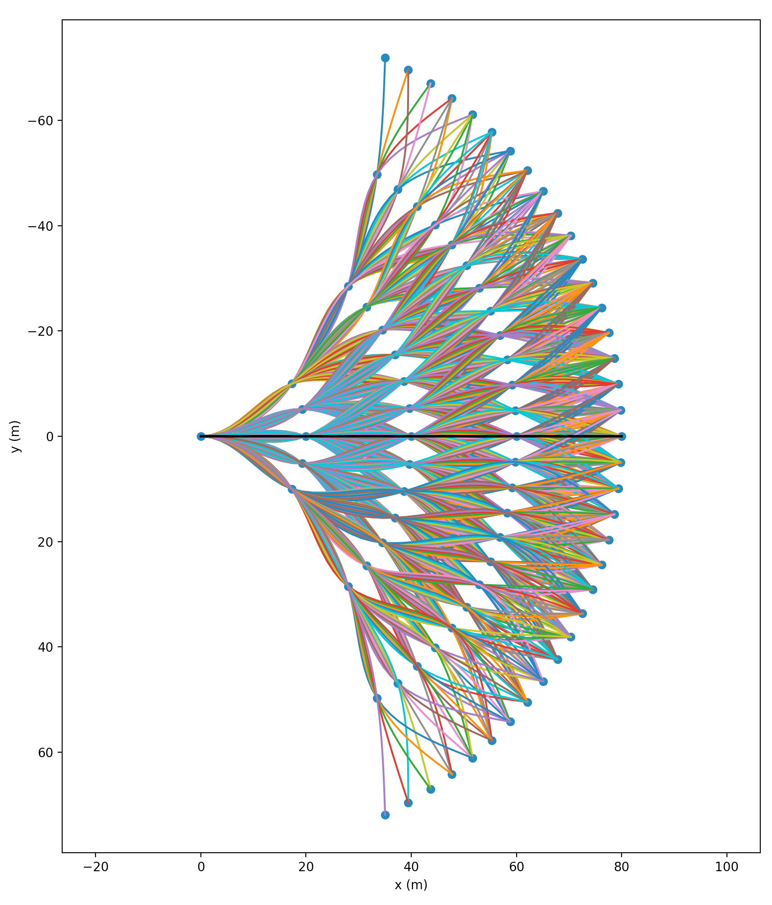

# Trajectory Library

Working project to build a trajectory library using curvature-continuous (C2) cubic splines




### Dependencies

```
- numpy
- scipy
- matplotlib
```

### Usage

`python generate_traj_lib.py long_sep arc_sep th_spread num_layers --outfile --plot=True`

Example:

`python generate_traj_lib.py  20 5 30 4 --plot=True`

Parameters:
```
long_sep:      longitudinal separation between layers (meters)
arc_sep:       approximate desired separation between adacent nodes along the arc (meters)
th_spread:     angle on each side of zero heading from prev layer nodes (degrees)
num_layers:    number of concentric arcs, exclusive of origin point (integer)
--num_interps: number of interpolated points evaluated for each trajectory (integer)
--outfile:     path to output file with .json suffix (default: ./traj_lib.json)
--plot:        boolean flag to plot trajectories
```

### Output Data Structure
```
Dictionary of enumerated trajectories each of the form:
{   'x':       list of x-coordinates (meters),
    'y':       list of y-coordinates (meters),
    'x_coef':  array of x-spline coefficients ( (num_layers + 1) x 4 ),
    'y_coef':  array of y-spline coefficients,
    'psi':     heading angle (radians),
    'k':       curvature
    'k_max':   maximum curvature
}
    
```

